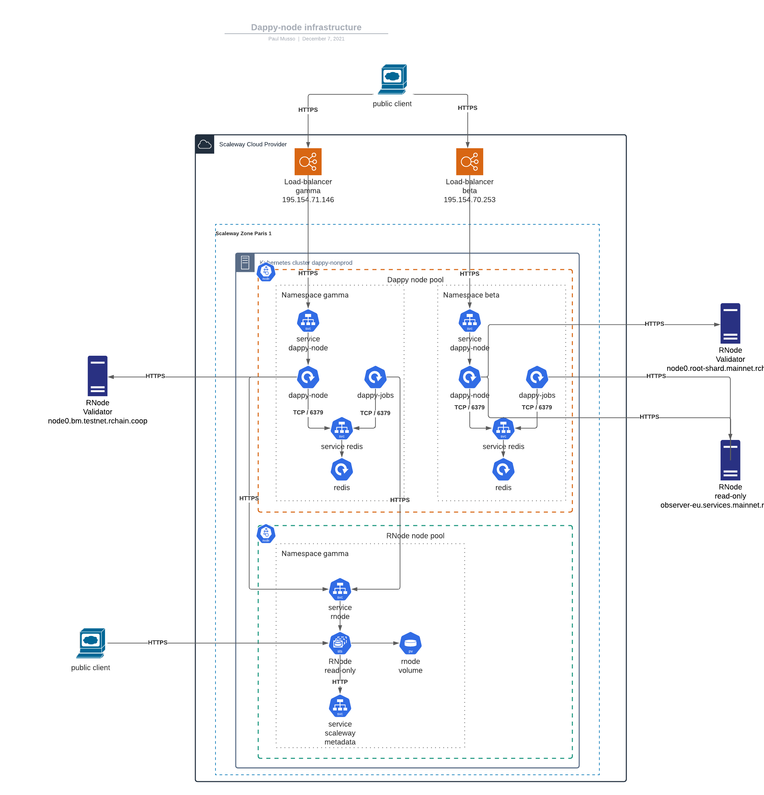

# Kubernetes

When deploying using kubernetes, we assume you have setup a secure postgreSQL database already. And know the `DAPPY_PG_CONNECTION_STRING` for allowing dappy-node to write/ready in the database.

## General architecture

The common/base kubernetes settings are in `kubernetes/base/`, those are the general settings that do not change, whatever the dappy network is. The base settings can be overwritten by those in `kubernetes/envs` that are namespace-specific and context-specific.

The specific configurations files are organized on a per-namespace basis, in the `kubernetes/envs/<CLOUD_PROVIDER>/` folder. We warmly invite you to duplicate this folder and create for example `kubernetes/envs/aws/` folder.

`kubernetes/envs/<CLOUD_PROVIDER>/` contains one folder per namespace. (see commands)

You may handle one, two or more dappy-node namespaces with this repository. An example:

- namespace 1 : **gamma**, connected to RChain testnet. Configuration files in `kubernetes/envs/<CLOUD_PROVIDER>/gamma`

- namespace 3 : **d**, connected to RChain mainnet. Configuration files in `kubernetes/envs/<CLOUD_PROVIDER>/d` (main dappy name system not deployed yet)

Non production dappy-node infrastructure



### Selection of namespace

You will probably have one namespace per dappy-node. Be careful to select the right one.

```
# Create a namespace (only at setup)
kubectl create ns node1-gamma

# See namespaces
kubectl get namespaces
> node1-gamma
> node2-gamma
> ...

# Pick namespace for the following operations
kubectl config set-context --current --namespace=node1-gamma
```

### Checking the pods

At the time this is written, a dappy-node should have 4 pods :
- `dappy-node-xxx` is the nodeJS / DoH endpoint
- `grafana-xxx` logs
- `prometheus-xxx` metrics

```
kubectl get pods
```

### Generate dappy-node key and certificate

This example is for `node1.d.fabco.dappy` for the d network and FABCO company. Change this to match your copany and the network you are generating this certificate for, examples:
- `node1.gamma.mycompany.dappy`
- `node2.gamma.helloblockchain.dappy`
- `node1.d.powerblockchain.dappy`

```sh
openssl req \
  -x509 \
  -newkey rsa:2048 \
  -sha256 \
  -days 3000 \
  -nodes \
  -keyout dappy-node.key \
  -out dappy-node.crt \
  -outform PEM \
  -subj '/CN=node1.d.fabco.dappy'\
  -extensions san \
  -config <( \
    echo '[req]'; \
    echo 'distinguished_name=req'; \
    echo '[san]'; \
    echo 'subjectAltName=DNS.1:localhost,DNS.2:node1.d.fabco.dappy')

# save as a secret
kubectl create secret tls dappy-node-tls --key="dappy-node.key" --cert="dappy-node.crt" -n=<NAMESPACE>
```

### Some manual configurations

**Be careful** : as of today for each namespace there are manual updates to do in some yml files before deploying pods - `kubectl apply` command.

**(1)** Update 3 lines in `kubernetes/envs/digitalocean/gamma/dappy/pg/dappy-node-ingress.yaml` so that the hostname matches with the hostname of your node in dappy-lookup codebase [src/dappyNetworks.ts](https://github.com/fabcotech/dappy-tools/blob/master/packages/dappy-lookup/src/dappyNetworks.ts). Example value : `node2.gamma.fabco.dappy`.

**(2)** Update 3 lines in `kubernetes/envs/digitalocean/gamma/dappy/pg/dappy-node-webpki-ingress.yaml` so that the public DNS subdomain you want to use to expose rnode. Example value : `node2.gamma.dappy.tech`.

### Deploy dappy-node kubernetes manifests

```sh

# generic command
kubectl apply -k kubernetes/envs/<CLOUD_PROVIDER>/<NAMESPACE>/dappy
# test / gamma network
kubectl apply -k kubernetes/envs/digitalocean/gamma/dappy/pg/
# production / d network
kubectl apply -k kubernetes/envs/digitalocean/d/dappy/pg/

# if ./ingresses folder exists, deploy it
kubectl apply -k kubernetes/envs/<CLOUD_PROVIDER>/<NAMESPACE>/ingresses

# if monitoring is required,, deploy it
kubectl apply -k kubernetes/envs/<CLOUD_PROVIDER>/<NAMESPACE>/monitoring
```
